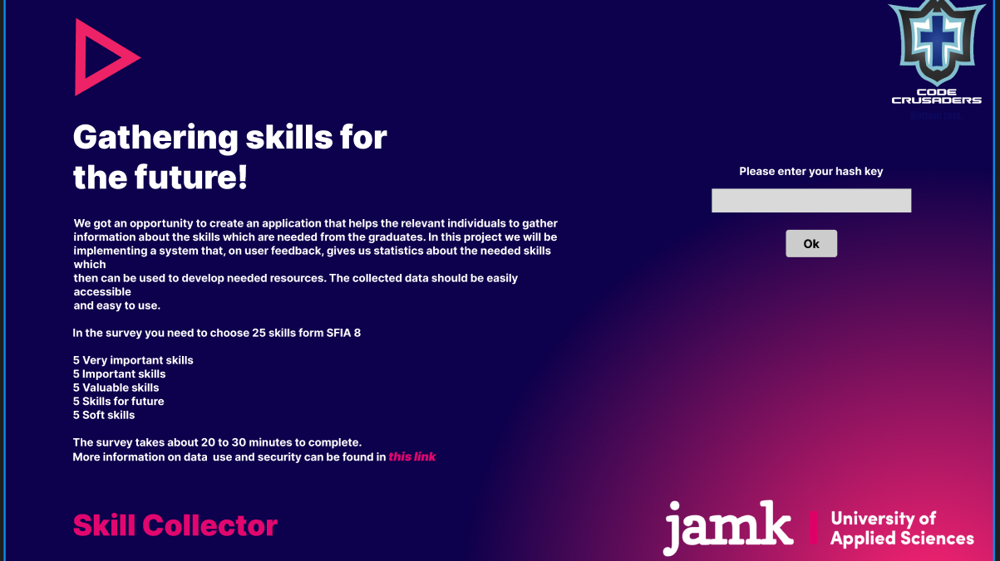
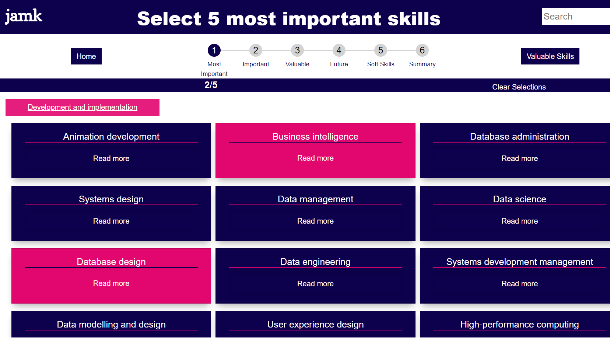
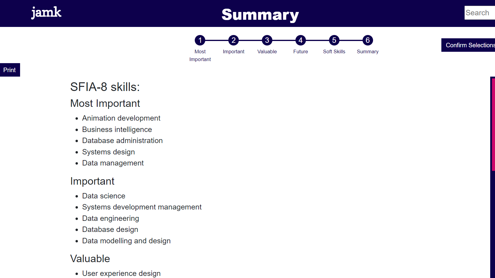
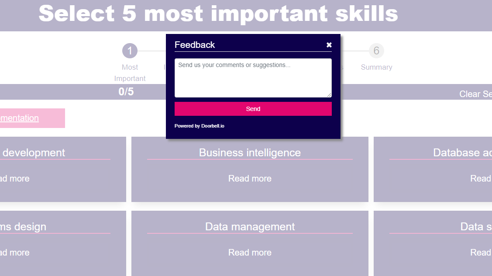

# 📥 Skillpicker – Future Skills Mapping Tool

**Skillpicker** is a web-based application designed to help bridge the gap between education and industry by collecting future skill needs directly from businesses. The gathered information is forwarded to educational institutions to support course planning and ensure that students are taught the competencies employers actually seek.

This project was developed by **Code Crusaders** during the *Future Factory* course at JAMK University of Applied Sciences, in collaboration with the **LIPPA project**.

---

| Name              | Role                           |
| ----------------- | ------------------------------ |
| Joni S      | Team Leader                    |
| Anthony Bäckström | Web Admin / Frontend Developer |
| Joel J    | Server Admin                   |
| Arttu K    | Frontend Developer             |
| Matias L     | Backend Developer              |

---
## Key Features

- Interactive web form for companies to submit desired future skills
- Based on the **SFIA** (Skills Framework for the Information Age)
- Data stored in a structured, machine-readable format
- Accessible and responsive user interface
- Helps education providers align programs with real industry needs

---

##  Communication & Collaboration

Skill Collector followed a structured communication plan to ensure smooth collaboration across all stakeholders.

### Communication Structure

**Stakeholders:**
- **Project Team:** Joni S, Anthony Bäckström, Joel J, Arttu K, Matias L  
- **Coaches & Advisors:** Marko Rintamäki (PO), Veeti Hakala, Juho Pekki, Heli Ciszek  
- **Clients & Stakeholders:** LIPPA, JAMK, and end-user companies  
- **External Parties:** e.g. department heads, technical advisors

### Channels Used:
- **Internal Communication:** Microsoft Teams (chat & meetings), weekly Zoom planning & review meetings  
- **Documentation:** JAMK reporting templates and shared files  
- **Scrum Practices:** Weekly sprints, sprint planning, and daily check-ins  
- **Project visibility:** Updates shared with stakeholders via Teams, email, and the project website  
- **Meeting Protocol:** Agendas and notes prepared by the project secretary and shared via Teams/email

### Communication Monitoring:
Communication effectiveness was reviewed weekly in coach meetings and adjusted as needed to ensure clarity and alignment across the project.

---

##  Screenshots

> Here's a quick look at what the Skill Collector app looks like in action:

| Home Page |
|-----------|
|  

| Skill Select |
|-----------|
|  

| Summary View |
|-----------|
|  

| Feedback |
|-----------|
 |

---

## 🧰 Tech Stack

- **Frontend**: HTML, CSS, JavaScript
- **Backend**: Node.js / Express *(update if different)*
- **Database**: MongoDB / Firebase *(update if different)*
- **Version Control**: Git & GitHub
- **Methodology**: Agile / Scrum

---

